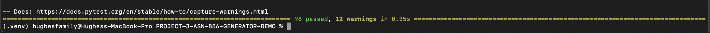
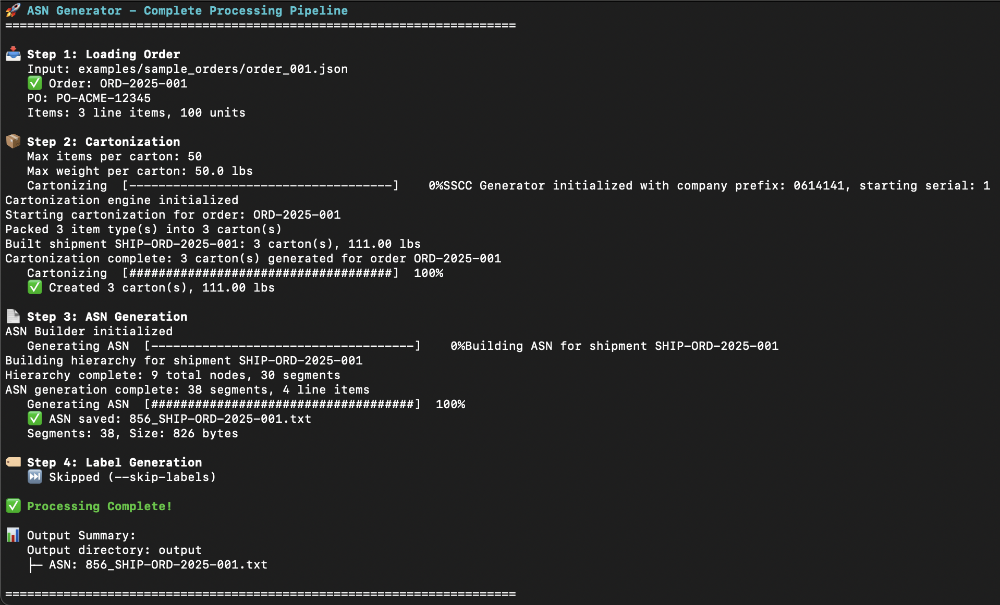
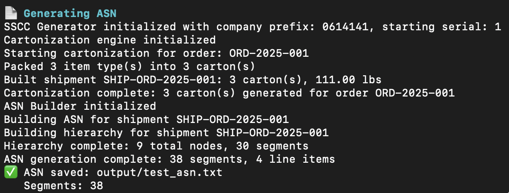
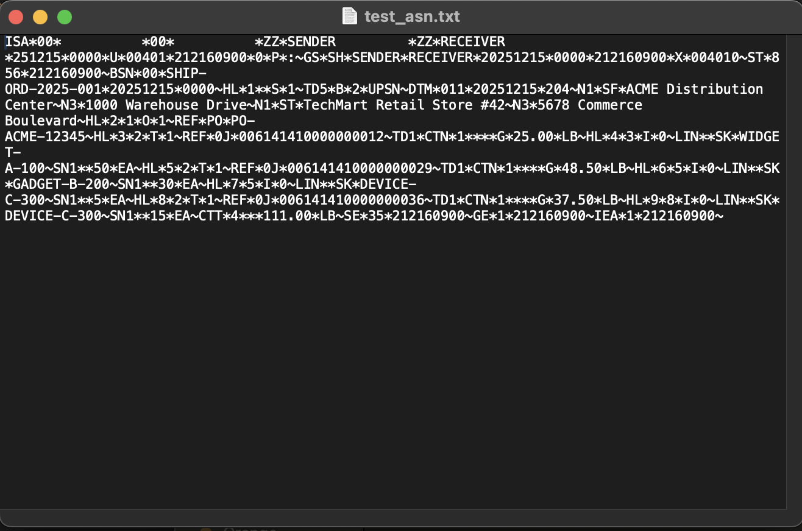

# ASN-856-GENERATOR

## EDI 856 ASN + GS1 SSCC-18 Label Generator

A portfolio-quality demonstration of professional EDI integration engineering and supply chain automation.

---

## Overview

This project demonstrates the ability to build a realistic **EDI 856 Advance Ship Notice (ASN)** generator combined with **GS1 SSCC-18 compliant shipping label** generation.

### Key Features

- ✅ **EDI 856 ASN Generation** — Proper hierarchical HL structure (Shipment → Order → Tare → Item)
- ✅ **GS1 SSCC-18 Compliance** — Correct SSCC generation with mod-10 check digit calculation
- ✅ **Cartonization Logic** — Automated packing of order items into cartons
- ✅ **Shipping Label Rendering** — GS1-128 barcoded labels in PDF/PNG format
- ✅ **Clean Architecture** — Modular, testable, production-style code
- ✅ **Full Validation** — Pydantic models with type safety and validation

---

## Architecture

### System Layers

```
┌─────────────────────────────────────────────┐
│  Layer 1: Input Parsing                     │
│  JSON/CSV → Validated Order Objects         │
└─────────────────────────────────────────────┘
                    ↓
┌─────────────────────────────────────────────┐
│  Layer 2: Cartonization Module              │
│  Packing Logic + SSCC Assignment            │
└─────────────────────────────────────────────┘
                    ↓
┌─────────────────────────────────────────────┐
│  Layer 3: 856 ASN Builder                   │
│  Hierarchical HL Segments (EDI X12)         │
└─────────────────────────────────────────────┘
                    ↓
┌─────────────────────────────────────────────┐
│  Layer 4: SSCC Label Generator              │
│  GS1-128 Barcodes + Printable Labels        │
└─────────────────────────────────────────────┘
                    ↓
┌─────────────────────────────────────────────┐
│  Layer 5: Output Bundling                   │
│  856 File + Label PDFs + Manifest           │
└─────────────────────────────────────────────┘
```

### Data Flow

```
Order JSON
    ↓
OrderInput (validated)
    ↓
Cartonization Engine
    ↓
Shipment + Cartons (with SSCCs)
    ↓
    ├─→ ASN Builder → EDI 856 File (.txt)
    │
    └─→ Label Generator → Shipping Labels (.pdf)
```

---

## Technology Stack

- **Python 3.9+** — Core processing language
- **Pydantic 2.5** — Data validation and modeling
- **Click 8.1** — Command-line interface framework
- **ReportLab 4.0** — PDF label generation
- **python-barcode 0.15** — GS1-128 barcode rendering
- **Pillow 10.1** — Image processing
- **pytest 7.4** — Testing framework

---

## Project Structure

```
asn-856-sscc-label-generator-demo/
├── src/
│   ├── models/                  # Data models (PART 1 ✅)
│   │   ├── input_models.py      # JSON/CSV input schemas
│   │   ├── internal_models.py   # Business objects
│   │   ├── asn_models.py        # EDI 856 structures
│   │   └── label_models.py      # SSCC & label models
│   ├── cartonization/           # Packing logic (PART 2)
│   ├── asn_builder/             # EDI generator (PART 3)
│   ├── sscc/                    # SSCC generator (PART 4)
│   ├── label_generator/         # Label rendering (PART 5)
│   └── utils/                   # Shared utilities
├── tests/                       # Test suite
│   └── test_models.py           # Model validation tests
├── examples/
│   └── sample_orders/           # Example order files
│       ├── order_001.json
│       └── order_002_multi_carton.json
├── output/                      # Generated files (856s + labels)
├── docs/                        # Documentation
│   └── PART_1_DATA_MODELS.md
├── requirements.txt             # Python dependencies
└── README.md                    # This file
```

---

## Business Context

### Real-World Business Context
In real supply chain and retail operations, Advance Ship Notices (EDI 856) are not optional artifacts — they are operationally critical documents used by retailers to plan receiving, schedule dock appointments, validate shipments, and reconcile inventory.

Incorrect ASN structure, invalid carton hierarchies, or mismatched SSCC labels commonly result in:
	•	ASN rejections during retailer onboarding
	•	Receiving delays at distribution centers
	•	Chargebacks for missing or invalid carton-level data
	•	Inventory mismatches between ASN, physical cartons, and invoices

This project simulates how suppliers generate ASNs and carton labels in production environments before transmitting data to trading partners.

### Example Scenario
A mid-market supplier ships a multi-carton order to a large retailer.

Before shipment:
	•	The order is processed internally from an ERP or OMS.
	•	Items must be packed into cartons based on quantity and weight constraints.
	•	Each carton must be assigned a unique GS1 SSCC-18.
	•	A compliant X12 856 ASN must be generated reflecting the physical shipment hierarchy.

This project models that workflow end-to-end by:
	•	Converting order data into cartonized shipments
	•	Generating SSCC-18 identifiers per carton
	•	Building a properly structured ASN with Shipment → Order → Tare (Carton) → Item HL loops
	•	Producing shipping labels aligned with the ASN carton data

### Production-Style ASN & Label Behavior
Real retailers enforce strict expectations beyond basic X12 syntax. This project reflects those realities by implementing:
	•	Proper HL hierarchy and parent/child relationships
	•	Carton-level SSCC tracking tied to ASN data
	•	Accurate quantity rollups from item → carton → shipment
	•	Consistent sequencing and identifiers across ASN segments
	•	Deterministic cartonization rules mirroring warehouse packing logic

The result is a portfolio-grade simulation of how ASNs and SSCC labels are generated in real supplier environments, not just a formatted EDI file.

---

## Installation

### Prerequisites

- Python 3.9 or higher
- pip (Python package manager)

### Setup

```bash
# Clone the repository
git clone <repository-url>
cd asn-856-sscc-label-generator-demo

# Create virtual environment (recommended)
python -m venv venv
source venv/bin/activate  # On Windows: venv\Scripts\activate

# Install dependencies
pip install -r requirements.txt
```

---

## Usage

### Input Format

Orders are submitted as JSON files following this structure:

```json
{
  "order_id": "ORD-2025-001",
  "purchase_order": "PO-12345",
  "ship_date": "2025-12-15",
  "ship_from": { ... },
  "ship_to": { ... },
  "items": [ ... ]
}
```

See `examples/sample_orders/` for complete examples.

### Command-Line Interface

#### Quick Start

```bash
# Process complete order (ASN + labels)
python main.py process --input examples/sample_orders/order_001.json

# Validate order file
python main.py validate examples/sample_orders/order_001.json

# Get help
python main.py --help
```

#### Available Commands

**Process Complete Order:**
```bash
python main.py process -i order.json -o output/
```

**Generate ASN Only:**
```bash
python main.py generate-asn -i order.json -o output/856.txt
```

**Generate Labels Only:**
```bash
python main.py generate-labels -i order.json -o output/labels/
```

**Validate Order:**
```bash
python main.py validate order.json
```

#### Options

```bash
# Custom carton limits
python main.py process -i order.json --max-items 30 --max-weight 75.0

# Skip label generation
python main.py process -i order.json --skip-labels

# Custom EDI IDs
python main.py process -i order.json --sender-id ACME --receiver-id CUSTOMER

# Show all examples
python main.py examples
```

See [Quick Start Guide](docs/QUICKSTART.md) for detailed instructions.

---

## Data Models (PART 1 — Complete)

### Input Models
- `OrderInput` — External order submission format
- `OrderLineItem` — Individual SKU line items
- `Address` — Shipping addresses

### Internal Models
- `Shipment` — Top-level shipment container
- `Order` — Customer order
- `Carton` — Packed carton with SSCC
- `Item` — SKU with quantity

### ASN Models
- `ASNDocument` — Complete EDI 856 structure
- `ASNHeader` — BSN segment + envelope
- `HierarchicalLevel` — HL segment tree
- `ASNSummary` — Transaction totals

### Label Models
- `SSCC` — GS1 SSCC-18 structure
- `ShippingLabel` — Complete label data
- `LabelConfig` — Rendering configuration
- `LabelBatch` — Multiple labels output

See `docs/PART_1_DATA_MODELS.md` for detailed documentation.

---

## EDI 856 Structure

The generated ASN follows standard X12 EDI format:

```
ISA*...*~                         (Interchange header)
GS*...*~                          (Functional group header)
ST*856*0001~                      (Transaction set: ASN)
BSN*00*<shipment_id>*<date>*~    (Beginning segment)

HL*1**S~                          (Shipment level)
  TD5*B*2*UPSN~                   (Carrier details)
  REF*BM*<BOL>~                   (Bill of lading)
  DTM*011*<ship_date>~            (Ship date)
  N1*SF*<ship_from_name>~         (Ship from)
  N1*ST*<ship_to_name>~           (Ship to)

  HL*2*1*O~                       (Order level)
    PRF*<PO_number>~              (Purchase order)

    HL*3*2*T~                     (Tare/Carton level)
      REF*0J*<SSCC>~              (SSCC reference)
      TD1*CTN*1~                  (Package details)

      HL*4*3*I~                   (Item level)
        LIN**SK*<SKU>~            (Item identification)
        SN1**<qty>*EA~            (Item quantity)

CTT*<line_count>~                 (Transaction totals)
SE*<segment_count>*0001~          (Transaction set trailer)
GE*1*1~                           (Functional group trailer)
IEA*1*000000001~                  (Interchange trailer)
```

---

## GS1 SSCC-18 Format

SSCC Structure:
```
┌─────────────────────────────────────────────┐
│  18-digit Serial Shipping Container Code    │
├───┬──────────────┬────────────────┬─────────┤
│ 0 │   0614141    │   123456789    │    8    │
└───┴──────────────┴────────────────┴─────────┘
  ^        ^              ^              ^
  │        │              │              └─ Check digit (mod-10)
  │        │              └─────────────── Serial reference
  │        └───────────────────────────── GS1 Company Prefix
  └────────────────────────────────────── Extension digit
```

---

## Testing

```bash
# Run all tests
pytest tests/ -v

# Run specific test file
pytest tests/test_models.py -v

# Run with coverage
pytest tests/ --cov=src --cov-report=html
```

---

## Example Outputs & Test Coverage

### ✅ Full Test Suite Passing


### 📦 End-to-End Processing Pipeline


### 📄 ASN Generation via CLI


### 🧾 Generated ASN File Output


---

## Standards & Compliance

- **EDI X12 Standard** — ASN/856 Transaction Set
- **GS1 Standards** — SSCC-18, Application Identifier (00)
- **GS1-128 Barcode** — ISO/IEC 15417 (Code 128)
- **ANSI ASC X12** — Electronic Data Interchange

---

## Author

**Integration Engineering Team**
- Role: Senior EDI Systems Engineer + Staff Architect
- Focus: Supply chain automation, EDI integration, and label generation systems

---

## License

This is a portfolio demonstration project. Contact for licensing information.

---

## Acknowledgments

Built following industry best practices for:
- EDI/X12 integration
- GS1 supply chain standards
- Python software architecture
- Production-grade system design

---

## Contact

**Brian Hughes**

[GitHub](https://github.com/itsbrianhughes) | [LinkedIn](https://linkedin.com/in/b-hughes)

---

**Status:** ✅ **PROJECT COMPLETE**

Full order-to-shipment workflow operational: Data Models, Cartonization, EDI 856 ASN Builder, SSCC Generator, Shipping Label Renderer, CLI Interface, and Complete Documentation.
